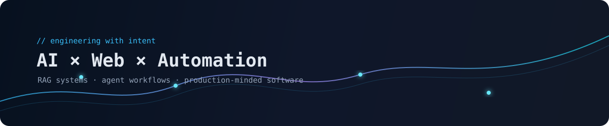
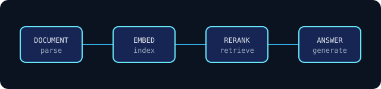
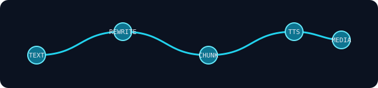
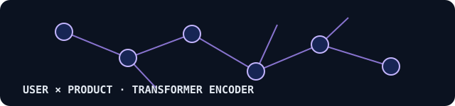

# Hi there 👋

 

<table align="center">
<tr>
<td align="center" width="160"><strong>14</strong> public repositories</td>
<td align="center" width="160"><strong>AI · RAG</strong> main focus</td>
<td align="center" width="160"><strong>Agents</strong> building direction</td>
<td align="center" width="160"><strong>HCMC</strong> Vietnam</td>
</tr>
</table>

 

## About me

I’m an AI engineer focused on turning complex requirements into practical, maintainable systems. My work spans document intelligence, RAG pipelines, agentic applications, NVIDIA AI deployments, and full-stack product development.

I care about the engineering underneath the demo: clear boundaries, observable pipelines, useful retrieval, and systems that can be operated in the real world.

## What I build

- **Document intelligence and RAG** — ingestion, parsing, chunking, embeddings, retrieval, reranking, and grounded answers.
- **Agentic applications** — tool use, workflow orchestration, MCP integrations, and business automation.
- **NVIDIA AI systems** — local inference, Nemotron experiments, GPU-aware deployments, and edge workflows.
- **Full-stack products** — Python services, APIs, web interfaces, databases, and deployment automation.

## Featured work

<table>
<tr>
<td width="50%" valign="top">

### Wiki RAG Server

Document intelligence and RAG pipeline built around Docling, embeddings, reranking, search, comparison, and grounded summarization.

<a href="https://github.com/baolnq-ai/wiki-rag-server-maxping-pipeline">Explore the project →</a>

</td>
<td width="50%" valign="top">

### Agent RAG Business

An IDP-first architecture where the upload and retrieval pipeline takes center stage, with LLMs supporting orchestration and search.

<a href="https://github.com/baolnq-ai/agent-rag-business">Explore the project →</a>

</td>
</tr>
<tr>
<td width="50%" valign="top">

### Multi-Agent Intelligent Warehouse

An applied AI project exploring intelligent warehouse workflows and multi-agent coordination.

<a href="https://github.com/baolnq-ai/Multi-Agent-Intelligent-WarehousePublic-nvidia">Explore the project →</a>

</td>
<td width="50%" valign="top">

### NVIDIA AI Experiments

Practical experiments with Nemotron, NemoClaw, Hermes, local inference, and agent tooling on NVIDIA hardware.

<a href="https://github.com/baolnq-ai/nvidia-nemotron-3-super-120b-a12b-nvfp4-in-spark-for-agent">Explore the project →</a>

</td>
</tr>
</table>

## Tools I use

  

`Python` · `PyTorch` · `Transformers` · `RAG` · `LLMs` · `Docling` · `FastAPI` · `TypeScript` · `React` · `Docker` · `PostgreSQL` · `NVIDIA AI`

## Selected repositories

| Repository | Focus |
|---|---|
| [`wiki-rag-server-maxping-pipeline`](https://github.com/baolnq-ai/wiki-rag-server-maxping-pipeline) | Document intelligence and RAG pipeline |
| [`agent-rag-business`](https://github.com/baolnq-ai/agent-rag-business) | IDP-first business RAG architecture |
| [`Multi-Agent-Intelligent-WarehousePublic-nvidia`](https://github.com/baolnq-ai/Multi-Agent-Intelligent-WarehousePublic-nvidia) | Multi-agent warehouse workflows |
| [`mcp-ntc-road-map-codex-agent`](https://github.com/baolnq-ai/mcp-ntc-road-map-codex-agent) | MCP and agent-assisted development |
| [`sts-translate-realtime-web`](https://github.com/baolnq-ai/sts-translate-realtime-web) | Real-time speech translation |
| [`upload-pipeline`](https://github.com/baolnq-ai/upload-pipeline) | File upload and processing pipeline |

  <a href="https://github.com/baolnq-ai?tab=repositories">Browse all repositories →</a>

